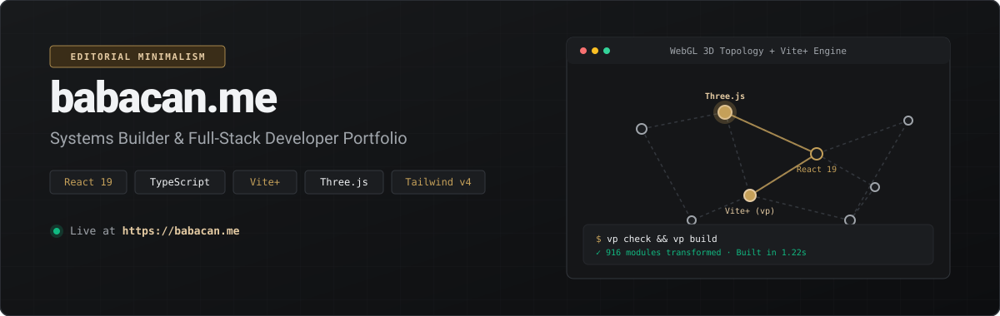
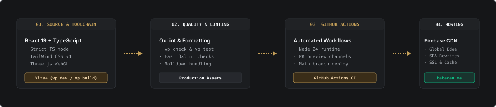

<p align="center">
  
</p>

<p align="center">
  <a href="https://babacan.me"></a>
  <a href="https://github.com/barissalihbabacan/babacan.me/actions"></a>
  <a href="https://viteplus.dev"></a>
  <a href="https://react.dev"></a>
  <a href="https://www.typescriptlang.org/"></a>
</p>

---

## 🏛️ Overview

**[babacan.me](https://babacan.me)** is the personal engineering portfolio of **Barış Salih Babacan** — Systems Builder & Full-Stack Developer.

Engineered with an **Editorial Minimalism** philosophy (_Kingsman Gold_ aesthetic), the project combines high-performance WebGL 3D graphics, full bilingual support (English/Turkish), automated GitHub statistics integration, and zero-config deployment.

---

## ⚡ System Architecture

<p align="center">
  
</p>

### Key Highlights

- 🎨 **Editorial Minimalism Design System**: Custom Charcoal (`#111214`) and Kingsman Gold (`#C5A059`) palette defined with Tailwind CSS v4 design tokens (`@theme`).
- 🌐 **Interactive 3D Topology**: Custom WebGL canvas built on Three.js (`@react-three/fiber` & `@react-three/drei`) with fallback error boundaries.
- ⚡ **Unified Toolchain (`Vite+ / vp`)**: Powered by Vite+, integrating Vite, Rolldown bundling, Oxlint static analysis, and Oxfmt formatting.
- 🌐 **Bilingual (EN / TR)**: Instant context-driven language switching via `LanguageContext` without page reloads.
- 🤖 **Automated Data Fetching**: Build-time script (`scripts/fetch-github-data.js`) fetching live GitHub user stats and repositories into `public/github-data.json`.
- 🚀 **Continuous Delivery**: GitHub Actions workflows for production merge deployments and temporary PR preview channels on Firebase Hosting.

---

## 🛠️ Technology Stack

| Domain                | Technology                       | Purpose                                           |
| :-------------------- | :------------------------------- | :------------------------------------------------ |
| **Core Framework**    | React 19.2 + TypeScript 6.0      | Strict type-safe UI architecture                  |
| **3D & Graphics**     | Three.js + React Three Fiber     | Real-time WebGL network topology background       |
| **Styling System**    | Tailwind CSS v4 + JetBrains Mono | Tokenized styling, editorial typography           |
| **Toolchain & Build** | Vite+ (`vp`)                     | Rolldown bundler, fast HMR, Oxlint                |
| **Hosting & Edge**    | Firebase Hosting                 | Global CDN, SPA rewrites, immutable asset caching |
| **CI/CD Pipeline**    | GitHub Actions (Node 24)         | Automated linting, build, and hosting deployment  |

---

## 📁 Repository Structure

```text
babacan.me/
├── .github/workflows/       # GitHub Actions (Firebase hosting merge & PR preview)
├── assets/readme/           # Repository SVG visual assets (Hero & Architecture)
├── public/                  # Static assets & generated github-data.json
├── scripts/                 # Pre-build data fetch script (fetch-github-data.js)
├── src/
│   ├── components/          # React components (Hero, Experience, Projects, NetworkGraphic)
│   ├── contexts/            # LanguageContext & i18n translation engine
│   ├── data/                # Project & experience data contracts
│   ├── styles/              # Tailwind CSS v4 design tokens (@theme)
│   ├── types/               # TypeScript interfaces & type definitions
│   ├── App.tsx              # Root application component & WebGL Boundary
│   └── main.tsx             # Application entry point
├── AGENTS.md                # AI Agent guidelines & Vite+ toolchain review checklist
├── DESIGN.md                # Design System Specification (Kingsman Gold)
├── tsconfig.json            # TypeScript configuration
└── package.json             # Project dependencies & devEngines contract
```

---

## 🚀 Local Development

This project uses **Vite+**, a unified web toolchain. Execute tasks via `vp`:

### Prerequisites

- **Node.js**: `24.x` or higher
- **npm**: `>= 11.0.0`

### 1. Clone & Install

```bash
git clone https://github.com/barissalihbabacan/babacan.me.git
cd babacan.me
vp install
```

### 2. Development Server

Start local dev server with HMR:

```bash
npm run dev      # Runs: vp dev (http://localhost:5173)
```

### 3. Check & Test

Run formatting, linting (Oxlint), and type checks:

```bash
vp check         # Format, lint, and type check
vp check --fix   # Automatically fix formatting/lint issues
```

### 4. Build & Preview

```bash
npm run build    # Pre-builds GitHub data & bundles via vp build
npm run preview  # Previews production bundle locally
```

---

## 🎨 Design System ("Kingsman Gold")

| Token                 | Hex       | Role                                        |
| :-------------------- | :-------- | :------------------------------------------ |
| **Background**        | `#111214` | Bespoke Charcoal atmospheric base           |
| **Surface**           | `#181A1C` | Raised content canvas                       |
| **Primary Accent**    | `#C5A059` | Kingsman Gold / Brass active states & links |
| **Primary Container** | `#3A2D18` | Deep Brass button containers                |
| **Text Primary**      | `#F1F3F5` | Crisp high-contrast text                    |
| **Text Secondary**    | `#A0A5AB` | Muted metadata text                         |

> For complete color system and typography specs, see [`DESIGN.md`](./DESIGN.md).

---

## 📄 License

Distributed under the **ISC License**. See [`LICENSE`](./LICENSE) for details.

Developed with precision by **[Barış Salih Babacan](https://github.com/barissalihbabacan)**.
